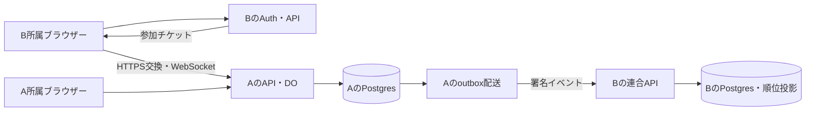
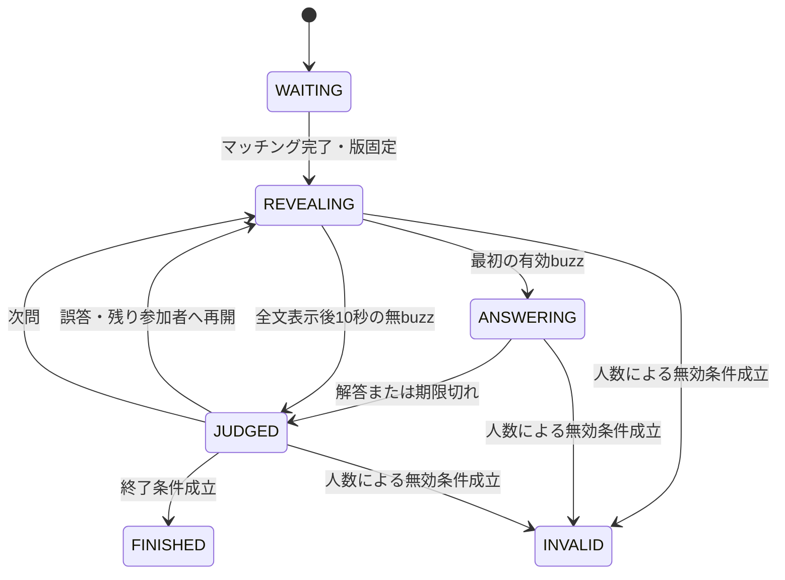

# アーキテクチャと対戦復旧

## 責務（企画要件）

| 層 | 採用案と境界 |
| --- | --- |
| UI | React + TypeScript + Tailwind CSS。表示と入力。採点しない |
| API | Hono on Cloudflare Workers。認証・認可、管理、連合、DBアクセス |
| 対戦 | Durable Objects + WebSocket。1ルーム1裁定者 |
| 永続DB | Supabase PostgreSQL。問題・ルール・結果・配送・順位投影 |
| 所属認証 | 各インスタンスのSupabase Auth |
| 開発基盤 | Node.js。開発・ビルド・テスト・CLI用 |

peerは各自のDB・Auth・鍵を持つ。開催元DOが唯一の裁定者で、対戦中のbuzzをpeer間合意で決めない。開始に必要な版と問題を取得済みなら、連合停止中も対戦を続けられる。

Workersは常駐Nodeサーバーではない。必要なNode APIとパッケージをnodejs_compat付きで検証する。[公式資料](https://developers.cloudflare.com/workers/runtime-apis/nodejs/)参照。HonoのWorkers構成は[公式ガイド](https://hono.dev/docs/getting-started/cloudflare-workers)を基にする。

WorkersからPostgresドライバーとSupavisor transaction poolerを用いる案。prepared statementsを無効化し、TLS・接続数・往復遅延・トランザクションを先行検証する。transaction poolerの制約は[Supabase公式資料](https://supabase.com/docs/guides/database/connecting-to-postgres)参照。ドライバー名と版は検証で確定する。buzzの勝敗にDB往復を挟まない。

## フロントエンド

ViteでReact + TypeScript + Tailwind CSSをビルドする。早押しボタン、文字選択パネル、得点表示などはReactの部品としてまとめる。スタイルの作業方針は[development.md](development.md)、採用理由は[ADR 0003](adr/0003-tailwind-css.md)を参照する。

## 状態遷移

- WAITING：自動マッチングの参加認証・接続・版取得を完了させて即開始。開始後の新規途中参加は不可、既存参加者は無効確定前に再接続可能。固定大会定義のplayersPerMatch人がそろったら開始。初期人数は調整用の仮値2人。
- REVEALING：表示済みの本文だけを配信。最初にDOが受け付けた有効buzzへ解答権を付与し、表示位置を凍結する。
- ANSWERING：actor、matchId、questionIdと版、解答権、締切を検証する。別接続から同じactorが送っても同じ権限として扱う。
- JUDGED：正解なら次問。誤答なら減点し当該問題をロック、残りの参加者へ凍結位置から再開。全員ロック済みなら次問。
- FINISHED：対戦操作を受理せず、結果保存と同期状態を返す。
- INVALID：人数条件で無効終了。理由と終了状態を永続化し、得点・勝数・参加数をランキングへ加えない。試合中の接続中actorが1人以下になったと開催元が判定した時点で猶予なく遷移する。FINISHED後の通常切断では結果を無効化しない。

全文表示後10秒の無buzzは無得点終了、解答時間切れは誤答扱い。判定表示は調整用の仮値2秒。無効条件は接続中actorが1人以下、猶予なし。正解の公開は再開しないと決まった問題の終了後のみ。誤答後に他プレイヤーの解答権が残る間は正解を配信しない。

## 裁定と再接続

コマンドは `commandId, matchId, questionId, type, payload` を持ち、actorは認証済み接続から取得する。自己申告時刻を信頼しない。DO内の非同期処理の割り込みでも二重裁定しないよう、状態更新と重複排除を直列化する。

`(matchId, actorId, commandId)` で重複排除。同一ID・同一内容は保存済み応答、内容違いは競合として拒否する。ACK・公開イベントの前に裁定状態とコマンド結果をDOストレージへ永続化する。

公開イベントに単調増加roomSeqを付ける。再接続はlastSeqを送信し、保持範囲なら差分、範囲外ならsnapshotとそのroomSeqで復旧する。snapshot以後のイベントを欠落なく送る。本文・得点・権利・締切・保存状態のみ公開し、正解や非公開本文は含めない。イベント保持期間は実装前に固定する。接続中actorが1人以下になった試合には再接続猶予を設けず、再接続時はINVALIDを返す。

締切はサーバー絶対時刻。`now >= deadline` を期限切れとする提案。タイマーだけでなくコマンド処理時にも検証し、タイマー遅延による期限後の解答を防ぐ。

## 接続人数と無効判定

接続数ではなく、認証済みの有効接続を少なくとも1本持つ参加actorの数を数える。同一actorのタブを閉じても他の有効接続があれば人数を減らさない。当該問題の誤答ロックは切断ではなく、人数から除外しない。

開催元が切断を検知して人数を更新した処理内で、REVEALING / ANSWERING / JUDGEDかつ1人以下ならINVALIDを永続化する。進行・採点・通常終了との競合はDOの裁定順で一意に解決し、一度INVALIDになった試合は復帰させない。2人対戦で片方の切断を検知すれば即無効となる。

「即時」は開催元の切断検知後に猶予を置かないという意味で、物理的な通信断を遅延ゼロで検知する保証ではない。close/errorと死活監視による検知方式・間隔は技術検証で確定し、検知待ちと再接続猶予を区別する。Hibernationやメモリ再構築の途中を接続0人と誤判定せず、接続情報を復元してから判定する。再接続による進行復元テストは、他に2人以上が接続していて無効化されない条件で行う。

## 文字選択の裁定（実装案）

解答者専用イベントで `attemptId, panelId, position, choices, deadline` を送る。選択コマンドは既存のcommandId等に加えてattemptId・panelId・選択肢IDを含む。正解かどうかを示すフラグは送らない。

DOは権利・期限・現在パネルとの一致を検証し、同じ選択の再送で位置を二重に進めない。パネルは生成時の並びとIDを永続化し、再接続やDO復帰でも同じ状態を返す。誤選択はその時点で誤答として裁定し、次のパネルを出さない。正しい文字なら次へ進み、最後まで正しければ正解とする。期限は解答権取得時刻＋固定answerTimeMsで、各文字ではリセットしない。

専用パネルを公開roomSeqイベントに混ぜない。公開snapshotに正答やパネルを含めず、認証した解答者本人へ現在のパネルと入力位置を別送する。正答全体の再構築につながる選択ログを観戦者や別参加者に公開しない。

## DOの永続化

状態、固定版、使用問題、表示位置、解答権、解答試行とパネル・選択位置、ロック集合、締切、接続人数判定に必要な情報、得点、裁定記録、roomSeq、重複排除情報、未保存結果・無効終了理由を保持する。Hibernation復帰では永続状態と接続情報から再構築し、期限を再評価する。

出題中の細かい配信は活動中に行う。休止中のsetInterval継続を前提とせず、絶対時刻とAlarmで復帰する。複数の期限と結果再試行は、最も近い予定をAlarmへ設定し、復帰時に残りを再設定する。Alarmの再実行でも処理は冪等にする。[WebSocket Hibernation公式資料](https://developers.cloudflare.com/durable-objects/best-practices/websockets/)参照。

長時間停止を一気に追いつかせて問題を読み飛ばさない復旧方針を提案する。復帰時に期限切れの現在状態を一度処理し、次の表示開始時刻を設定する。停止中の不利を含め、試合成立条件で評価する。

## 結果保存

1. DOでresultIdと不変の結果ペイロードを作成し、未保存として永続化する。
2. Postgresの同一トランザクションで結果・結果イベント・配送先別outboxを追加する。
3. commit確認後、DOの保存済み状態を永続化し、UIを「確定」にする。
4. commit後に応答が消失しても同じresultIdと内容で再試行し、既存レコードとの一致を確認して成功とする。内容違いは隔離する。
5. outboxを別処理で配送し、peerごとの受領と順位反映を別々に観測する。

DOとPostgresに分散トランザクションはない。DB停止中は保存中を維持し、Alarmで再試行する。配送処理の定期起動はWorkerのscheduled handlerを初期案とし、インメモリの待ち時間だけに依存しない。VPSへ移植する際はDOと永続タイマーの代替設計が必要。
