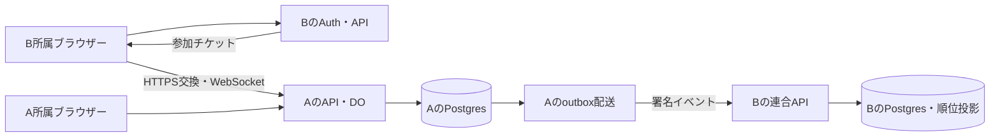
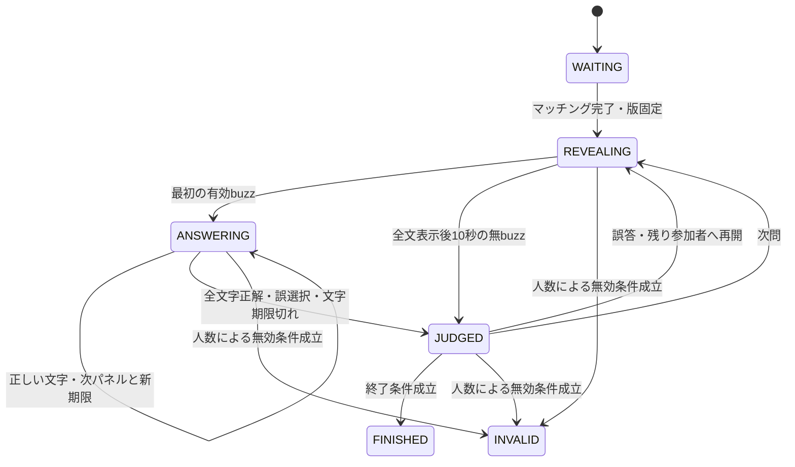

# アーキテクチャと対戦復旧

## 責務（企画要件）

| 層 | 採用案と境界 |
| --- | --- |
| UI | React + TypeScript + Tailwind CSS。表示と入力。採点しない |
| API | Hono on Cloudflare Workers。認証・認可、管理、連合、DBアクセス |
| 対戦 | Durable Objects + WebSocket。1ルーム1裁定者 |
| 永続DB | Supabase PostgreSQL。問題・ルール・結果・配送・順位投影 |
| 所属認証 | 各インスタンスのSupabase Auth |
| 開発基盤 | Node.js。開発・ビルド・テスト・CLI用 |

peerは各自のDB・Auth・鍵を持つ。開催元DOが唯一の裁定者で、対戦中のbuzzをpeer間合意で決めない。開始に必要な版と問題を取得済みなら、連合停止中も対戦を続けられる。

Workersは常駐Nodeサーバーではない。必要なNode APIとパッケージをnodejs_compat付きで検証する。[公式資料](https://developers.cloudflare.com/workers/runtime-apis/nodejs/)参照。HonoのWorkers構成は[公式ガイド](https://hono.dev/docs/getting-started/cloudflare-workers)を基にする。

WorkersからPostgresドライバーとSupavisor transaction poolerを用いる案。prepared statementsを無効化し、TLS・接続数・往復遅延・トランザクションを先行検証する。transaction poolerの制約は[Supabase公式資料](https://supabase.com/docs/guides/database/connecting-to-postgres)参照。ドライバー名と版は検証で確定する。buzzの勝敗にDB往復を挟まない。

## フロントエンド

ViteでReact + TypeScript + Tailwind CSSをビルドする。早押しボタン、文字選択パネル、得点表示などはReactの部品としてまとめる。スタイルの作業方針は[development.md](development.md)、採用理由は[ADR 0003](adr/0003-tailwind-css.md)を参照する。

## 状態遷移

- WAITING：自動マッチングの参加認証・接続・版取得を完了させて即開始。開始後の新規途中参加は不可、既存参加者は無効確定前に再接続可能。固定大会定義のplayersPerMatch人がそろったら開始。初期人数は4人。検証用・サーバー固有の人数をコンフィグから大会固定版へ保存する。
- REVEALING：表示済みの本文だけを配信。最初にDOが受け付けた有効buzzへ解答権を付与し、表示位置を凍結する。
- ANSWERING：actor、matchId、questionIdと版、解答権、締切を検証する。別接続から同じactorが送っても同じ権限として扱う。
- JUDGED：正解なら次問。誤答ならお手つきを1回加算し当該問題をロック、累計3回で失格として以後のbuzz・文字選択を拒否する。失格していない残りの参加者へ凍結位置から再開。全員ロック済みなら次問。ただし7問先取ならFINISHEDへ進み、失格していない参加者が1人以下ならINVALIDへ進む。問題枯渇時はその時点の成績で判定してFINISHEDへ進む（未失格者の正解数が単独最多なら勝利、最多同数なら引き分け）。
- FINISHED：対戦操作を受理せず、結果保存と同期状態を返す。
- INVALID：人数条件で無効終了。理由と終了状態を永続化し、得点・勝数・参加数をランキングへ加えない。試合中の接続中actorが1人以下の状態が30秒続いた場合、または未失格者が1人以下になった場合に遷移する。後者は猶予なし。FINISHED後の通常切断では結果を無効化しない。

全文表示後10秒の無buzzは無得点終了、解答時間切れは誤答扱い。判定表示は調整用の仮値2秒。無効条件は接続中actorが1人以下、または失格していない参加者が1人以下で、接続人数不足には30秒の一時停止・復帰猶予を設け、未失格者不足には猶予を設けない。正解の公開は再開しないと決まった問題の終了後のみ。誤答後に他プレイヤーの解答権が残る間は正解全文を配信しない。2026-09-13変更：共有設定オンの試合では、回答者が実際に選んだ文字は正誤を問わず公開する。

## 裁定と再接続

コマンドは `commandId, matchId, questionId, type, payload` を持ち、actorは認証済み接続から取得する。自己申告時刻を信頼しない。DO内の非同期処理の割り込みでも二重裁定しないよう、状態更新と重複排除を直列化する。

`(matchId, actorId, commandId)` で重複排除。同一ID・同一内容は保存済み応答、内容違いは競合として拒否する。ACK・公開イベントの前に裁定状態とコマンド結果をDOストレージへ永続化する。

公開イベントに単調増加roomSeqを付ける。再接続はlastSeqを送信し、保持範囲なら差分、範囲外ならsnapshotとそのroomSeqで復旧する。snapshot以後のイベントを欠落なく送る。本文・得点・権利・締切・保存状態と、共有設定オンの場合だけ受理済みの選択文字を公開する。未選択の正解や非公開本文は含めない。1Bでは直近60秒かつ最大512件を保持する。1Bで差分保持とsnapshotへのフォールバックを実装した。接続中actorが1人以下になった試合は30秒の猶予中に一時停止し、期限内の復帰なら再開、期限以後はINVALIDを返す。

締切はサーバー絶対時刻。`now >= deadline` を期限切れとする（2026-09-11採用）。タイマーだけでなくコマンド処理時にも検証し、タイマー遅延による期限後の解答を防ぐ。

## 接続人数と無効判定

接続数ではなく、認証済みの有効接続を少なくとも1本持つ参加actorの数を数える。同一actorのタブを閉じても他の有効接続があれば人数を減らさない。当該問題の誤答ロックと試合中の失格は切断ではなく、接続中のactor数から除外しない。接続人数と失格していない参加者数は別々に数える。接続人数が1人以下、または失格していない参加者数が1人以下ならINVALIDにする。当該問題だけのロックで後者を減らさない。

開催元が切断を検知して人数を更新した処理内で、REVEALING / ANSWERING / JUDGEDかつ1人以下なら30秒の猶予期限と残り時間を永続化する。期限内の復帰がなければINVALIDを永続化する。進行・採点・通常終了との競合はDOの裁定順で一意に解決し、一度INVALIDになった試合は復帰させない。2人対戦で片方の切断を検知すると一時停止し、30秒間復帰を待つ。

30秒の猶予は開催元の人数不足検知から数える。物理的な通信断を遅延ゼロで検知する保証ではない。close/errorと死活監視による検知方式・間隔は技術検証で確定し、検知待ちと再接続猶予を区別する。Hibernationやメモリ再構築の途中を接続0人と誤判定せず、接続情報を復元してから判定する。再接続の検証は、他に2人以上残って進行を続ける場合と、人数不足で一時停止する場合の両方で行う。

失格を確定する裁定内でも失格していない参加者数を更新し、1人以下ならINVALIDを永続化する。通常進行で残り1人の時点で終了するため全員失格まで進めず、復元時に全員失格の状態を検出した場合も無効とする。判定順は、無効条件、7問先取、問題枯渇、同問再開または次問の順とし、一度確定した終端状態を後続イベントで変更しない。問題枯渇時も無効条件を優先する。

## 文字選択の裁定（実装案）

解答者専用イベントで `attemptId, panelId, position, choices, deadline` を送る。選択コマンドは既存のcommandId等に加えてattemptId・panelId・選択肢IDを含む。正解かどうかを示すフラグは送らない。

DOは権利・期限・現在パネルとの一致を検証し、同じ選択の再送で位置を二重に進めない。パネルは生成時の並びとIDを永続化し、再接続やDO復帰でも同じ状態を返す。誤選択はその時点で誤答として裁定し、次のパネルを出さない。正しい文字なら次へ進み、最後まで正しければ正解とする。期限は現在パネルのサーバー有効化時刻＋固定characterAnswerTimeMs（初期値3000ms）とし、次の文字のパネル有効化時に新しい期限を設定する。再送・再接続・DO復帰で同一パネルの期限を更新しない。古いパネルのタイマーが新しいパネルを誤答にしないよう、attemptId・panelIdと期限を照合する。誤選択・期限切れの競合でもお手つき加算と失格判定は1回だけ行う。

専用パネルを公開roomSeqイベントに混ぜない。公開snapshotに正答やパネルを含めず、認証した解答者本人へ現在のパネルと入力位置を別送する。正答全体の再構築につながる選択ログを観戦者や別参加者に公開しない。

## DOの永続化

状態、固定版、使用問題、表示位置、解答権、解答試行とパネル・選択位置、ロック集合、正解数・累計お手つき数・失格状態、締切、接続人数判定に必要な情報、得点、裁定記録、roomSeq、重複排除情報、未保存結果・無効終了理由を保持する。Hibernation復帰では永続状態と接続情報から再構築し、期限を再評価する。

出題中の細かい配信は活動中に行う。休止中のsetInterval継続を前提とせず、絶対時刻とAlarmで復帰する。複数の期限と結果再試行は、最も近い予定をAlarmへ設定し、復帰時に残りを再設定する。Alarmの再実行でも処理は冪等にする。[WebSocket Hibernation公式資料](https://developers.cloudflare.com/durable-objects/best-practices/websockets/)参照。

長時間停止を一気に追いつかせて問題を読み飛ばさない復旧方針を採用する（2026-09-11）。復帰時に期限切れの現在状態を一度処理し、次の表示開始時刻を設定する。停止中の不利を含め、試合成立条件で評価する。

## 結果保存

1. DOでresultIdと不変の結果ペイロードを作成し、未保存として永続化する。
2. Postgresの同一トランザクションで結果・結果イベント・配送先別outboxを追加する。
3. commit確認後、DOの保存済み状態を永続化し、UIを「確定」にする。
4. commit後に応答が消失しても同じresultIdと内容で再試行し、既存レコードとの一致を確認して成功とする。内容違いは隔離する。
5. outboxを別処理で配送し、peerごとの受領と順位反映を別々に観測する。

DOとPostgresに分散トランザクションはない。DB停止中は保存中を維持し、Alarmで再試行する。配送処理の定期起動はWorkerのscheduled handlerを初期案とし、インメモリの待ち時間だけに依存しない。VPSへ移植する際はDOと永続タイマーの代替設計が必要。

## 2026-09-11：段階1の採用仕様

問題枯渇時は未失格者の正解数が単独最多なら勝利、最多同数なら引き分けとする。1Bの死活監視は5秒間隔・15秒無応答を初期値とし、検知後の接続人数不足には30秒の猶予を設ける。1Bで次問・無効化・差分・死活監視をローカル実装・検証済み。DO内の終端結果はDB確定保存ではない。実装範囲と復帰契約は[1B手順](phase-1b.md)を参照。

DOの直列化と保存後送信はCloudflareの[State API](https://developers.cloudflare.com/durable-objects/api/state/)・[WebSocket API](https://developers.cloudflare.com/durable-objects/best-practices/websockets/)を確認して実装した。

## 2026-09-13：クライアントの無応答監視と再接続上限

レビュー指摘2件を修正。WebSocket確立・初回状態の待機は10秒、有効なstate/deltaを受信した後は15秒の受信監視へ切り替える。状態受信ごとに監視期限を更新し、ACK・エラーだけでは延長しない。無応答時は古い接続を切り離し、closeイベントの到着を待たず再接続する。古い接続から遅れて届くイベントは無視する。

再接続は1.5秒間隔を維持し、連続5回の上限を撤廃。クライアントが最初の切断・接続失敗を検知してから30秒を上限に試行する。接続が開いただけでは上限をリセットせず、有効な状態の受信で復旧と判定する。30秒で接続中の試行も停止し、手動再接続を案内する。1008のポリシー拒否は即時停止を維持する。

この30秒はクライアントの自動再試行の上限で、サーバーの人数不足による復帰猶予とは検知時刻が異なり得る。試合再開の可否はサーバーの期限・状態を正とし、クライアントから延長しない。待機中・初回接続も同じ再試行方針を使う。

## 2026-09-14：1Cの固定版読込と参加経路

worker/catalogが専用のDB接続から不変の大会・ルール・問題セットと停止状態を読み、内容hashと候補等を検証する。game/stateは検証済み定義を受け取り、問題・ルール・識別子を複製して固定できる。正式参加ではMatchmaker DOが認証済みactorの予約を直列化し、GameRoom DOが定員・取消・接続完了を直列化する。待機時の版を開始直前に再検証し、DB停止・問題停止なら開始しない。開始済み試合はDO保存済みデータを維持する。[1C手順](phase-1c.md)参照。

## 2026-09-14：設定値と稼働中の正

人数・ルール・問題セットはJSONを入力にDBの不変版へ反映し、有効プロファイルを切り替える。新規マッチングは有効版を毎回DBから読み、大会版ごとに待機列を分ける。開始前検証は待機時に保存した版を明示して読み、設定変更で既存部屋の人数・ルールを変えない。復帰も既存版を維持する。運用上の監視時間・待機期限・上限はconfig/runtime.jsonに置く。詳細は[設定手順](configuration.md)。

2026-09-14：catalogの読込・設定反映、初期seed、probeのDB操作をDrizzleへ置換。DB読込は順序付きJOINを1回実行して同一snapshotの情報を取得する。JSONの有効化は専用writerのtransaction内で問題検証・版追加/再利用・有効参照の更新を行う。migrationもDrizzleへ統一。DBとDOの既存データは保持。[DB管理](database.md)参照。

2026-09-14レビュー修正：MatchmakerのDB読込をblockConcurrencyWhileの外へ移動した。読込前にリクエスト回数と読込識別子を保存し、読込後は待機列・参加状況・定員を再取得して予約する。DB待ち中も他actorの取消・復帰・Alarmを処理する。同一actorの後発要求や取消で失効した読込結果は予約へ使わない。DB障害は503へ変換し、既存予約は保持する。
